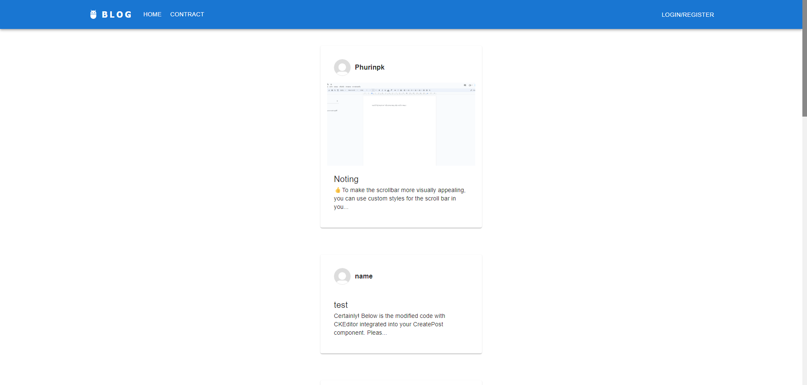
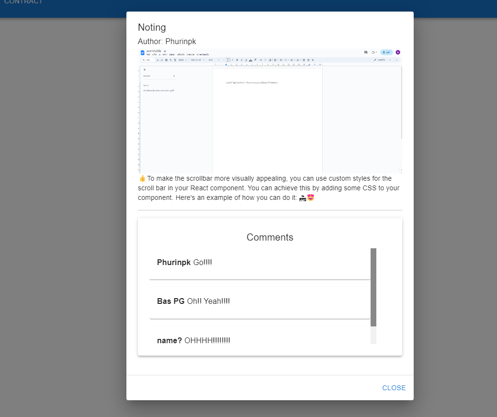
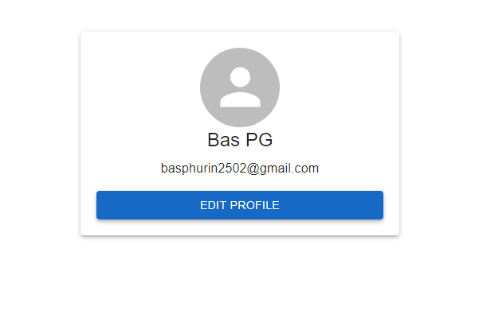
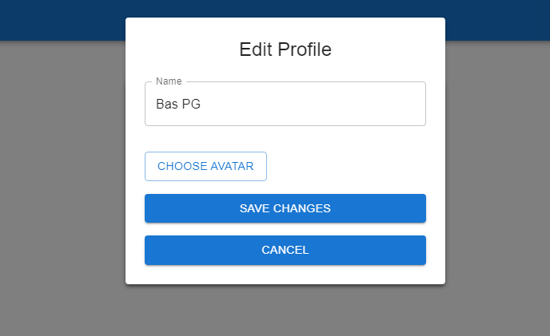

# Web Blog Demo

This project is a simple web blog demo built with Node.js, React.js, MongoDB, and Express.
homepage

modal post

Edit post

profile

Edit profile (add avatar not avaliable)

## Installation

1. **Create Database:**
   - Create a MongoDB database named "my-database".

     

   - Customize the database name in `server.js`.

     

2. **Configure Server:**
   - Open `server.js` and update the database name.

3. **Run Client:**
   - Navigate to the `client` directory.
   - Run `npm run dev` to start the React.js development server.

4. **Run Server:**
   - Navigate to the `server` directory.
   - Run `npm start` to start the Express server.

5. **Ready to Run:**
   - With both the client and server running, your web blog demo is ready! 🏃

## Project Stack
- Node.js
- React.js
- MongoDB
- Express

Feel free to explore and modify the project to suit your needs.
